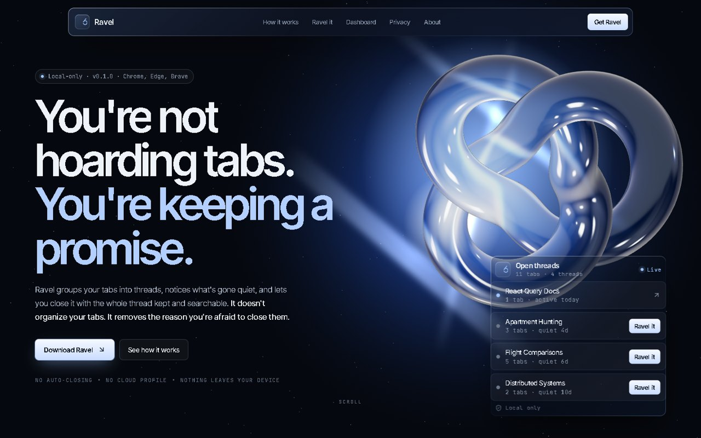
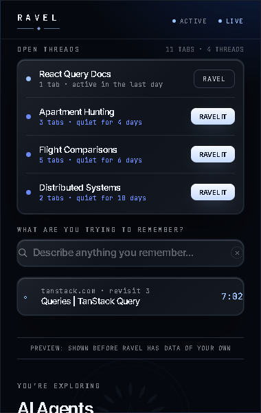
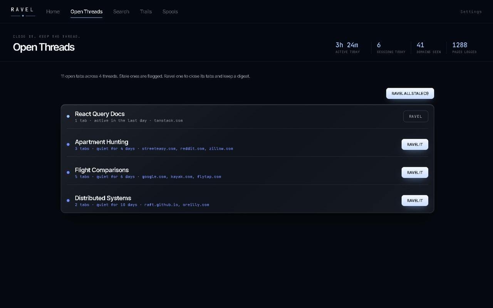
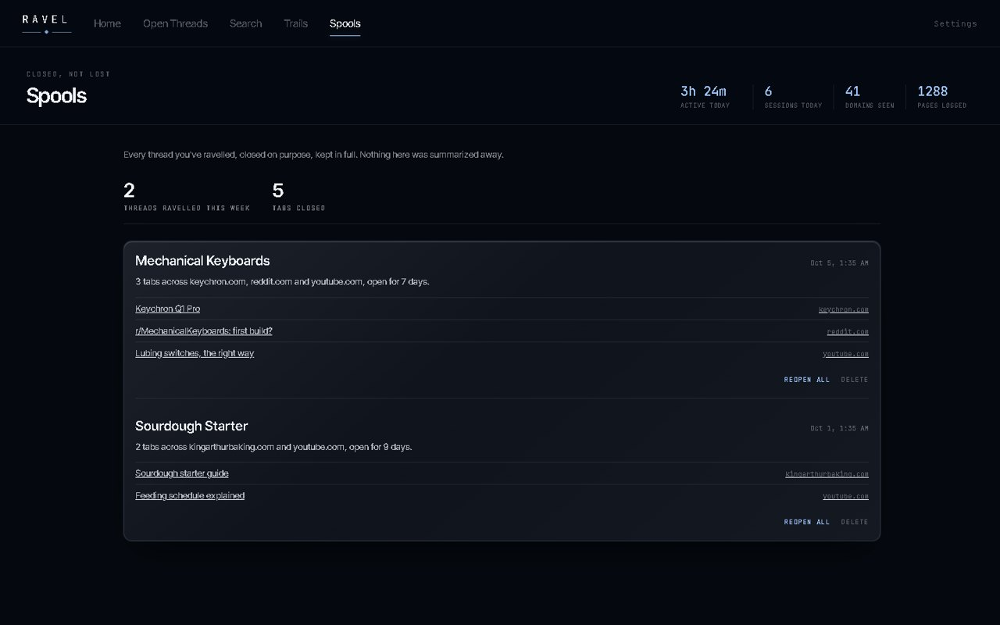

<div align="center">


# Ravel

**Close any tab without losing your place.**

Ravel groups your open tabs into threads, notices which ones have gone quiet, and lets you close them with the whole thread kept and searchable. Everything stays on your device.

[Website](https://ravel.runs-on.dev) · [Download](https://ravel.runs-on.dev/download) · [Install from source](#build-from-source)




</div>

## Why

You're not hoarding tabs. You're keeping a promise to come back to them. Closing a tab feels like losing the thread, so the tabs pile up, and the thread gets lost anyway.

Ravel doesn't organize your tabs. It removes the reason you're afraid to close them.

## What it does

| | |
|---|---|
| **Open threads** | Every open http(s) tab, grouped by what it's actually about. No folders, no manual tidying. |
| **Quiet thread nudges** | A thread untouched for a few days (you choose how many) is flagged as safe to close. Nothing ever closes automatically. |
| **Ravel it** | One click closes the thread's tabs and keeps a digest of every title, site and time span as a **spool**. |
| **Spools** | Every thread you've ravelled, kept in full and reopenable whenever you need it. |
| **Search** | Find things in plain words, like *"that apartment from last week"*, and see how you got there. |
| **Trails** | The rabbit holes you fell into, mapped out as paths you can walk back through. |

<div align="center">

&nbsp;

<br/><br/>

</div>

## Privacy by architecture

Ravel needs to see your tabs to group them. It never needs to send them anywhere.

- **No network requests.** The extension has no server to talk to. Grouping, flagging, search and spools all run in the browser.
- **Local storage only.** Everything lives in the browser's IndexedDB. Export it or delete everything from the settings page at any time.
- **Permissions:** `tabs` (to read titles and URLs and close what you ravel) and `alarms` (to re-run analysis periodically). A content script on http(s) pages measures active reading time and reads page titles and descriptions.
- **Fonts are bundled.** Nothing is fetched from a CDN; the pages run under a `script-src 'self'` policy.

## Install

### From the website (easiest)

Ravel isn't on the Chrome Web Store yet.

1. Download the zip from [ravel.runs-on.dev/download](https://ravel.runs-on.dev/download) and unzip it somewhere permanent.
2. Open `chrome://extensions` (or `edge://extensions`, `brave://extensions`).
3. Turn on **Developer mode**.
4. Click **Load unpacked** and choose the `ravel-extension` folder (the one with `manifest.json` inside).
5. Pin Ravel from the puzzle-piece menu.

### Build from source

Requires Node 20 or newer.

```bash
npm install
npm run build
```

Then load the generated `dist_pkg/` folder with **Load unpacked**.

The build does two different things on purpose:

- `tsc` compiles the service worker and the extension pages (popup, dashboard, options) to real ES modules.
- `esbuild` bundles the content script into a single dependency-free IIFE, because content scripts declared in the manifest can't be ES modules.

## Project structure

```
src/
  background/   service worker: the only writer to storage, runs analysis on an alarm
  content/      content script: page observation and active-time ticks
  adapters/     per-site readers (generic, YouTube, Instagram, Netflix)
  analysis/     topic clustering, stale threads, rabbit holes, search, trace-back
  storage/      IndexedDB schema and repositories
  popup/        the toolbar popup (open threads, search, current page)
  dashboard/    full-page dashboard (home, threads, search, trails, spools)
  options/      settings, plus about, privacy and cookie pages
  design/       tokens, base styles and bundled fonts (Inter Tight, JetBrains Mono)
icons/          extension icons
build.mjs       build script (tsc + esbuild, assembles dist_pkg/)
```

## Design

The interface uses the same ice-blue glass language as the website: a graphite field, one ice accent for anything live or actionable, a deeper cobalt for anything asking for a decision, and sharp glass panels. All colours, radii and type live in `src/design/tokens.css`.

## Licence

No licence has been chosen yet, so all rights are reserved by the author for now. Open an issue if you'd like to use or contribute to the code.

---

<div align="center">
<sub>Close it. Keep the thread. · A work of <a href="https://mithunsidhaarth.in">Mithun Sidhaarth</a></sub>
</div>
